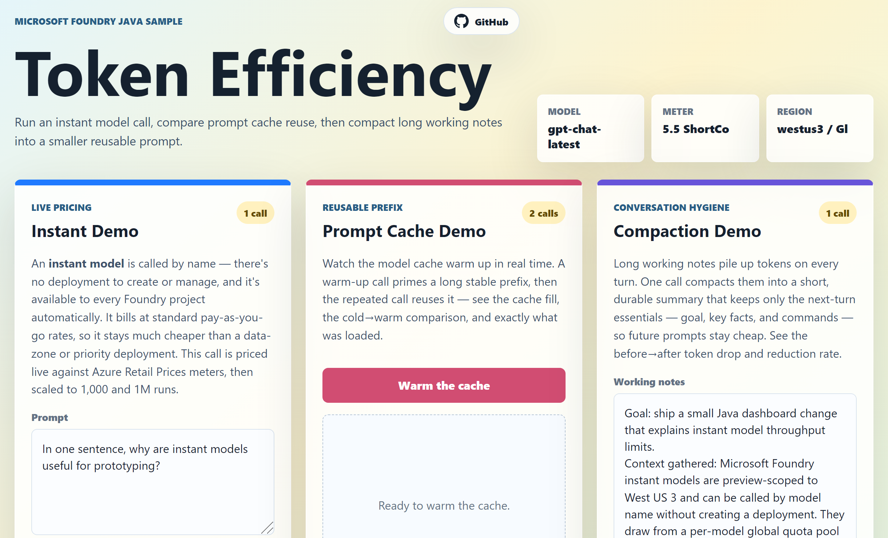
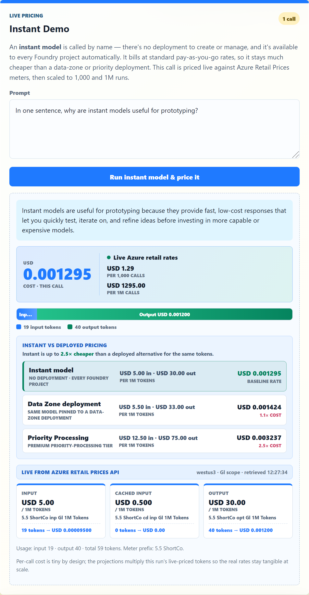
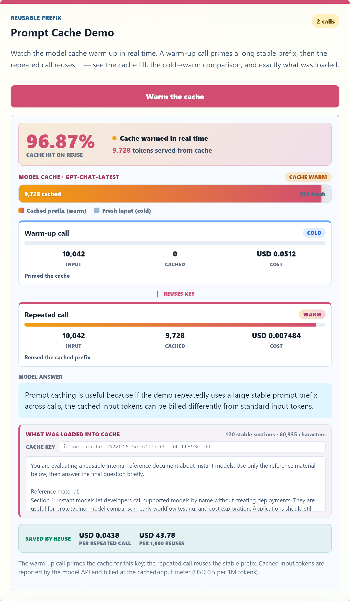
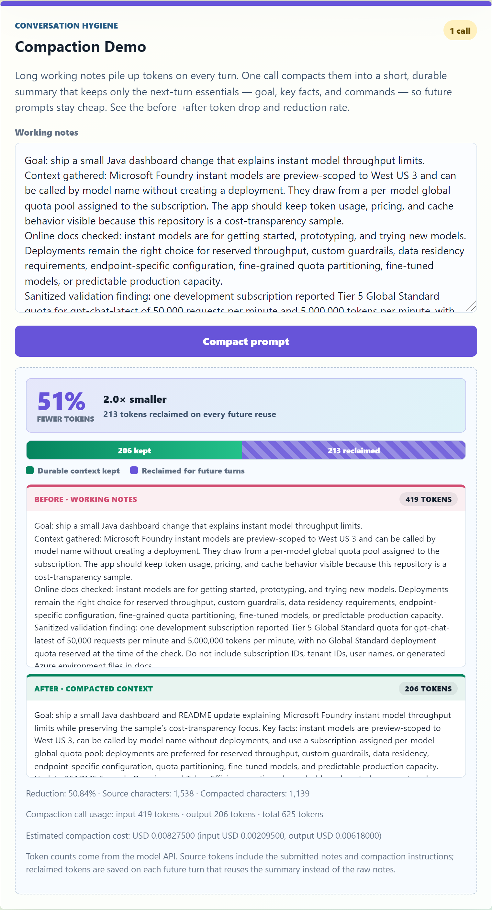

# Token Efficiency Is a Product Feature

## A Java demo with Microsoft Foundry instant models

Live demo: [http://aka.ms/costs](http://aka.ms/costs)

Repo: [https://github.com/roryp/instantmodels](https://github.com/roryp/instantmodels)

{ width=6.5in }

*The dashboard starts with three focused workflows: a small instant model call, a prompt cache comparison, and a compaction demo.*

## Why I Built This

Token efficiency is becoming an important part of how we design, build, and operate AI applications. As more teams move from experimentation into production, the question is no longer only whether a model can produce a useful answer. The question is also how much context was required, how much output was generated, whether any of the input was cached, and what the estimated cost of that interaction was.

I built a small Java demo to make those tradeoffs visible. The demo uses Microsoft Foundry instant models and shows three common patterns that affect token usage: direct model calls, prompt caching, and conversation compaction. It also connects token usage to pricing so that cost is not treated as an abstract concern or a surprise that only shows up later.

For me, that is the useful part. Token efficiency should be visible while an application is being designed, not only after it is already running in production.

## Instant Models

The first part of the demo is a direct instant model call. This is the simplest pattern: a focused prompt is sent to the model, the response comes back, and the application displays the token usage and estimated cost.

This matters because not every task needs agent orchestration, tool calling, long-running context, or a large instruction surface. For simple work, a direct model call can be easier to understand, easier to measure, and often more efficient.

The code path is intentionally small:

```java
Response response = responsesClient().getResponseService().create(new ResponseCreateParams.Builder()
        .input(prompt)
        .model(InstantModelsConfig.model())
        .build());
```

The client uses Microsoft Entra authentication through `DefaultAzureCredential`, which keeps API keys out of the sample and makes the demo closer to the pattern I would want in a real app.

{ width=6.5in }

*Representative metric view using sample values from the README and article capture data. Live values vary by model, region, prompt, quota, and pricing response.*

## What About Agents?

This does not mean agents are the wrong pattern. Agents are valuable when the application needs planning, tools, iteration, and multi-step execution.

The point is that those capabilities have a cost. Tool schemas, instructions, previous messages, attached context, and external connections can all increase the amount of information sent to the model. Token efficiency starts by matching the architecture to the task instead of defaulting every interaction to the heaviest possible workflow.

In practice, that means using agents when their extra capabilities are actually part of the product experience, and using simpler model calls when the job is small and well scoped.

## Prompt Caching

The second part of the demo shows prompt caching. Many AI applications repeatedly send the same large body of context to the model. This might be a policy document, a product catalogue, a coding standard, a rubric, or a long set of instructions.

When that stable context is reused across calls, prompt caching can reduce the cost of repeated input by allowing the reusable prefix to be billed differently from fresh input.

The important design point is that caching works best when the reusable context is deliberate and stable. If the prompt changes constantly, the cache benefit is reduced. This pushes teams to think more carefully about prompt structure. Stable context should be separated from request-specific context. Instructions should be consistent where possible. Large reference material should not be casually mixed with volatile user input if the goal is to benefit from caching.

In the demo, the cache workflow sends the same long reference prompt twice with a stable `promptCacheKey`. The first call pays for the full prefix. The repeated call can reuse the cached prefix, shifting most of the repeated input into the cached-input meter.

{ width=6.2in }

*The repeated call keeps the same total input size, but most of the reusable prefix is reported as cached input.*

## Compaction

The third part of the demo shows conversation compaction. Long-running assistant sessions can become expensive when every new request carries the full history of exploration, debugging, false starts, decisions, logs, and intermediate discussion.

Some of that history is useful. Some of it is no longer necessary. Compaction creates a shorter summary that can be used as future context instead of repeatedly sending the entire conversation.

Compaction is not free, because the compaction step itself uses tokens. The benefit comes when the shorter summary is reused in later calls. That makes compaction an engineering tradeoff rather than a generic best practice. It is most useful when a session is long enough that the future savings outweigh the cost of summarising the current context.

{ width=6.2in }

*Compaction is not free. The win comes when the shorter summary replaces repeated raw context in later turns.*

## Pricing

The demo also uses pricing information so that token counts can be connected to estimated cost. This is important because token usage alone is only part of the story. Input tokens, cached input tokens, and output tokens can have different rates.

A useful application should make those categories visible so developers can understand what is driving cost. The calculation is intentionally straightforward: standard input tokens, cached input tokens, and output tokens are counted separately and then matched against the relevant pricing meters from the Azure Retail Prices API.

```text
cost = standard_input_tokens * standard_input_rate
     + cached_input_tokens * cached_input_rate
     + output_tokens * output_rate
```

This gives developers and product teams a clearer view of where cost is coming from and what can be changed. A team might reduce repeated input through caching, reduce unnecessary output with better response constraints, or avoid loading tools that are not needed for a particular workflow.

This is also where token efficiency becomes a product design concern. It is not only an infrastructure or finance issue. A product that sends too much context, keeps unnecessary tools enabled, or allows sessions to grow indefinitely will behave differently from one that is designed with scoped prompts, stable reusable context, and clear workflow boundaries.

## Practical Lessons

There are a few practical lessons from the demo:

- Use direct model calls when the task is simple.
- Use the smallest model that can reliably complete the work.
- Keep prompts specific and avoid attaching unnecessary context.
- Disable unused MCP servers and external tools when they are not needed.
- Separate stable context from request-specific context so caching can be effective.
- Compact long sessions when the future savings justify it.
- Measure output tokens as carefully as input tokens, because long responses also affect cost.
- Price against live meters instead of stale assumptions.

None of these are dramatic by themselves. They are small design choices that add up, especially when an AI feature moves from a prototype to something used repeatedly by real people.

## Try The Demo

From a clean checkout:

```powershell
mvn test
mvn compile exec:java
```

To run the web dashboard locally:

```powershell
mvn spring-boot:run
```

Then open:

```text
http://localhost:8080
```

For Azure deployment, the repo uses `azd` with Azure Container Apps, a user-assigned managed identity, Azure Container Registry, and Microsoft Foundry access through RBAC.

```powershell
az login
azd auth login
azd env new instantmodels --location westus3
azd up
```

## My Takeaway

The most useful part of this demo is that it makes token efficiency visible during development. Developers should not have to wait for a billing surprise before they start asking how much context their application is sending.

Token efficiency is not about making prompts as small as possible. It is about using the right amount of context, the right model, and the right workflow for the job. That makes applications easier to reason about, easier to operate, and more predictable in production.

Live demo: [http://aka.ms/costs](http://aka.ms/costs)

Repo: [https://github.com/roryp/instantmodels](https://github.com/roryp/instantmodels)